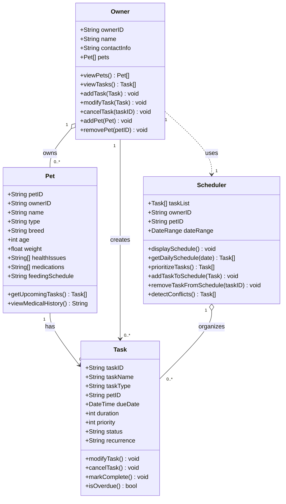

# PawPal+ Project Reflection

## 1. System Design

**a. Initial design**

- Briefly describe your initial UML design.
three core actions the user should be able to perform: add a pet-related task (walk/feed), view schedule each day, add pet(s)
- What classes did you include, and what responsibilities did you assign to each?
The classes I want to include are: Pet, Owner, Task, Scheduler.

Pet
- Attributes: petID, ownerID, name, type (animal), breed, age, weight, healthIssues, medications, feedingSchedule/dietaryNeeds
- Methods: getUpcomingTasks(), viewMedicalHistory()

Owner
- Attributes: ownerID, name, contactInfo (email/phone), pets (list of Pet)
- Methods: viewPets(), viewTasks(), addTask(), modifyTask(), cancelTask(), addPet(), removePet()

Task
- Attributes: taskID, taskName, taskType (feed/walk/medication/appointment), petID, dueDate/time, duration, priority, status (pending/completed/cancelled), recurrence
- Methods: modifyTask(), cancelTask(), markComplete(), isOverdue()

Scheduler
- Attributes: taskList (list of Task), ownerID, petID, date/dateRange
- Methods: displaySchedule(), getDailySchedule(), prioritizeTasks(), addTaskToSchedule(), removeTaskFromSchedule(), detectConflicts()

Design notes:
- Classes are linked by IDs (ownerID, petID, taskID) rather than names, since names are not unique and can change.
- Relationships are held explicitly: Owner has a list of Pets, and Scheduler holds a list of Tasks.

**Class diagram (Mermaid):**

**b. Design changes**

- Did your design change during implementation?
- If yes, describe at least one change and why you made it.

---

## 2. Scheduling Logic and Tradeoffs

**a. Constraints and priorities**

- What constraints does your scheduler consider (for example: time, priority, preferences)?
- How did you decide which constraints mattered most?

**b. Tradeoffs**

- Describe one tradeoff your scheduler makes.
- Why is that tradeoff reasonable for this scenario?

---

## 3. AI Collaboration

**a. How you used AI**

- How did you use AI tools during this project (for example: design brainstorming, debugging, refactoring)?
- What kinds of prompts or questions were most helpful?

**b. Judgment and verification**

- Describe one moment where you did not accept an AI suggestion as-is.
- How did you evaluate or verify what the AI suggested?

---

## 4. Testing and Verification

**a. What you tested**

- What behaviors did you test?
- Why were these tests important?

**b. Confidence**

- How confident are you that your scheduler works correctly?
- What edge cases would you test next if you had more time?

---

## 5. Reflection

**a. What went well**

- What part of this project are you most satisfied with?

**b. What you would improve**

- If you had another iteration, what would you improve or redesign?

**c. Key takeaway**

- What is one important thing you learned about designing systems or working with AI on this project?
